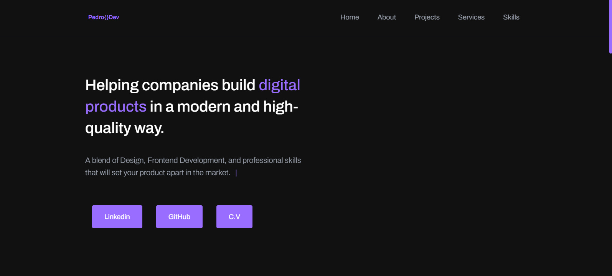

<h1 align="center">
  💻 Portfolio - Pedro Tortoriello
</h1>

<h4 align="center"><a href="https://www.pedrotortoriello.com.br/">Click to visit the project</a></h4>

## 📚 Sections

The website is composed of five sections:

- **Home:** Here we have a brief introduction;
- **About Me:** In this section, I have a description talking a bit about who I am;
- **Experiences:** I discuss some companies where I provided my services in development and design;
- **Projects:** Presents some developed projects with direct links to their respective GitHub repositories;
- **Services:** Displays different services I have knowledge of through cards;
- **Skills:** Here, I present my skills in some languages with a focus on front-end development;

---

## 💼 Technologies Used

For the development of this website, I used the following technologies:

- HTML;
- Sass;
- JavaScript;
- ScrollReveal;
- SVG Inject;

---

<h2>👨🏻‍💻 Author</h2>

<table>
  <tr>
    <td align="center">
      <a href="https://github.com/PedroFTDev">
         
        
          <b>Pedro T.</b>
        
      </a>
    </td>
  </tr>
</table>
